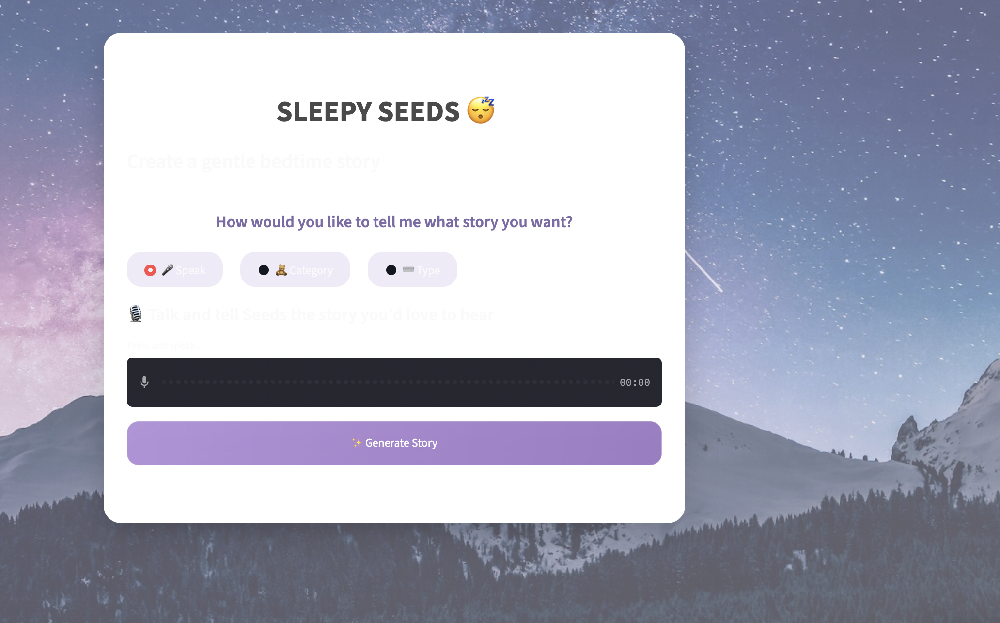
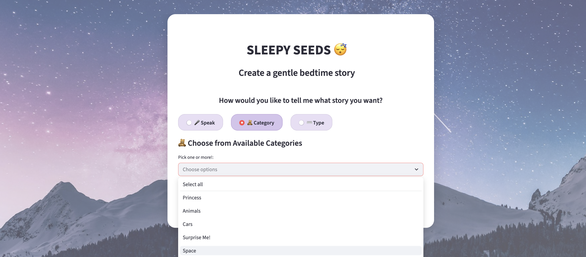
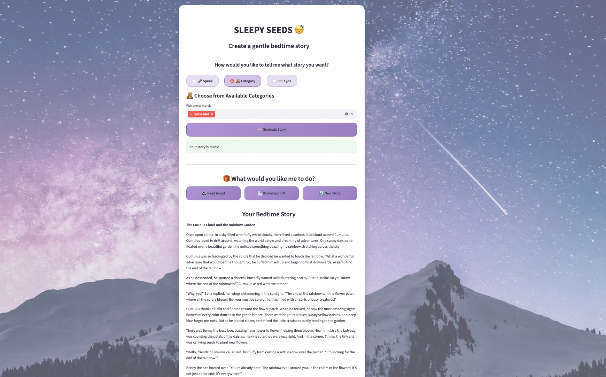

<div align="center">


[](https://python.org)
[](https://streamlit.io)
[](https://openai.com)
[](https://openai.com/research/whisper)
[](https://docker.com)

<br/>

> **An interactive bedtime story app for children aged 5–10.**  
> Multi-layer safety · AI story generation · voice input · audio narration · PDF export.

</div>

---

## 📸 Screenshots

**Home — Speak, Choose, or Type your story**


**Category Picker — Princess, Animals, Space, Surprise Me! and more**


**Generated Story — Read Aloud · Download PDF · New Story**


> *Curious what happens when **Cumulus the Cloud** goes looking for the end of the rainbow? 🌈☁️  
> [📄 Download the story to find out!](./bedtime_story.pdf)

---

## 🌙 What it does

Sleepy Seeds lets children request a bedtime story by speaking, picking a category, or typing — then generates a calm, age-appropriate, morally positive story using GPT-4 Mini. Every request passes through a **3-layer safety pipeline** before a single word is generated.

```
Child Input (voice 🎙 / category 🧸 / text ⌨️)
        │
        ▼
┌───────────────────┐
│  Safety Sanitizer  │  ← Layer 1: Keyword filter (violence, adult themes, grooming)
└────────┬──────────┘
         ▼
┌───────────────────┐
│ Semantic Analyzer  │  ← Layer 2: Subtle unsafe content detection
└────────┬──────────┘
         ▼
┌───────────────────┐
│    Classifier      │  ← Categorizes & routes request
└────────┬──────────┘
         ▼
┌───────────────────┐
│  Story Generator   │  ← GPT-4 Mini · 300–400 words · temp 0.7
└────────┬──────────┘
         ▼
┌───────────────────┐
│   LLM Judge        │  ← Scores safety + age-appropriateness + quality
│   Score < 7?  ──────→  Refiner improves the story automatically
└────────┬──────────┘
         ▼
  ✅ Safe bedtime story
  🔊 Read Aloud  ·  📄 Download PDF  ·  🔄 New Story
```

---

## ✨ Features

| Feature | Details |
|---|---|
| 🛡 **3-layer safety** | Keyword filter → semantic analysis → LLM judge/refiner |
| 🎙 **Voice input** | Real-time transcription via OpenAI Whisper API |
| 🧸 **Category picker** | Princess · Animals · Cars · Space · Surprise Me! and more |
| 🤖 **AI story generation** | GPT-4 Mini · 300–400 words · calming tone · positive themes |
| 🔊 **Read Aloud** | OpenAI TTS narrates the story |
| 📄 **PDF export** | Download a beautifully formatted story keepsake |
| 🐳 **Docker ready** | One-command containerized deployment |

---

## 🛡 Safety Architecture

**Layer 1 — Keyword Filter**
Catches obvious unsafe content: violence, adult themes, trauma, grooming attempts.

**Layer 2 — Semantic Analysis**
Detects subtle inappropriate content that keywords miss — context-aware filtering.

**Layer 3 — LLM Judge & Refiner**
Scores every story on safety, age-appropriateness, and quality (0–10).
Stories scoring below 7 are automatically refined before delivery.

### Edge Case Handling

| Input | Behavior |
|---|---|
| `"Tell me a story about a princess who loves flowers"` | ✅ Calm bedtime story generated |
| `"Tell me a story about a dragon fighting people"` | ↩️ Redirected to non-violent version |
| `"Harry Potter and the Chamber of Secrets"` | ⚠️ Keyword flagged, context safe → safe story generated |
| `"Keep this secret from parents"` | 🚫 Unsafe intent detected → request ignored, safe story instead |

---

## 🚀 Getting Started

**Option 1 — Run locally**

```bash
git clone https://github.com/CosmicMicra/Story-App-Sleepy-Seeds.git
cd Story-App-Sleepy-Seeds
pip install -r requirements.txt
export OPENAI_API_KEY='your-key-here'
streamlit run app.py
```

**Option 2 — Docker**

```bash
docker build -t sleepy-seeds .
docker run -p 8501:8501 sleepy-seeds
```

App runs at `http://localhost:8501`

---

## 🏗 Project Structure

```
sleepy-seeds/
├── app.py                      # Streamlit frontend
├── main.py                     # Core orchestration
├── styles.css                  # Custom UI styling
├── Dockerfile
├── requirements.txt
├── story/
│   ├── classifier.py           # Request categorization & routing
│   ├── generator.py            # GPT-4 Mini story creation
│   ├── judge.py                # Quality & safety scoring
│   ├── refiner.py              # Story improvement (score < 7)
│   └── sanitizer.py            # Multi-layer safety pipeline
├── audio/
│   ├── transcriber.py          # Whisper voice input
│   └── tts.py                  # Text-to-speech narration
└── utils/
    └── pdf_generator.py        # PDF export
```

---

## 🛠 Tech Stack

<p>
  
</p>

| Component | Technology |
|---|---|
| **Frontend** | Streamlit · custom CSS |
| **Story Generation** | GPT-4 Mini (OpenAI) |
| **Voice Input** | OpenAI Whisper API |
| **Audio Narration** | OpenAI TTS |
| **Safety Pipeline** | Keyword filter · semantic analysis · LLM judge/refiner |
| **PDF Export** | pdf_generator.py |
| **Deployment** | Docker |

---

## 🌟 Future Enhancements

- 👤 **Personalized story profiles** — remember each child's favorite characters and themes
- 🎨 **DALL·E integration** — generate 2–3 illustrations per story
- 👨‍👩‍👧 **Parents dashboard** — monitor usage and story preferences

---

## 👩‍💻 Author

**Soniya Phaltane** · [@CosmicMicra](https://github.com/CosmicMicra)  
ML Engineer · AI Security · [soniyaphaltane-portfolio.netlify.app](https://soniyaphaltane-portfolio.netlify.app)

<div align="center">
  
</div>
